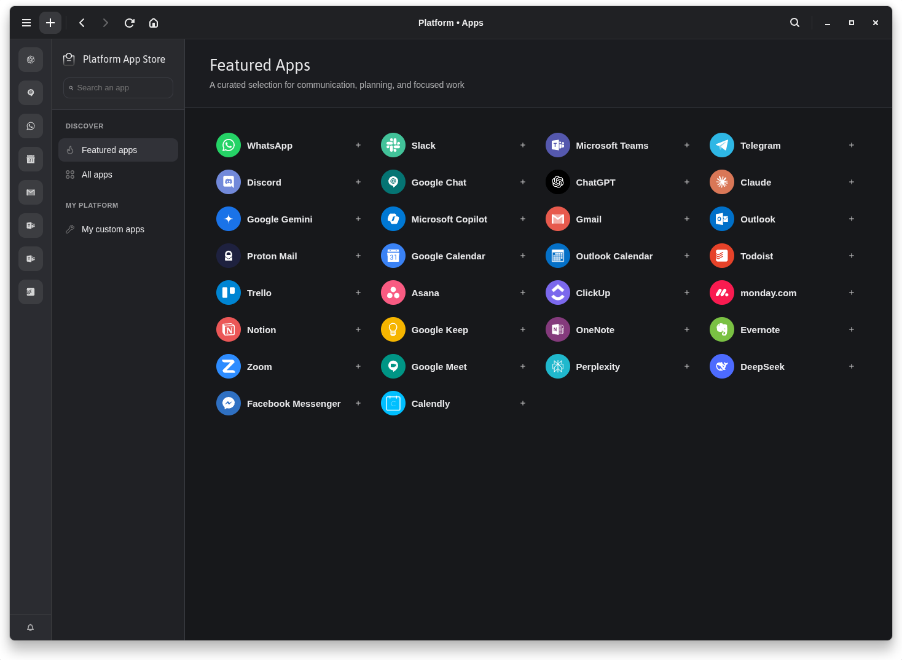

# Platform

Platform is a community-maintained continuation of [Station Desktop](https://github.com/getstation/desktop-app), the workspace that brings web apps and multiple accounts together in one desktop app.

The goal is simple: preserve the workflow people enjoyed in Station while keeping it useful with today's services and operating systems.



## What this fork changes

- Keeps Station's workflow working on current systems, with reliable sign-in, notifications, external links and spell-check.
- Refreshes the experience with a curated App Store, clearer app and account controls, and support for custom app icons.
- Gives the project its own Platform identity and provides ready-to-use builds for Linux and Windows.

## Table of Contents

- [Installation](#installation)
  - [Ready-to-use builds](#ready-to-use-builds)
  - [Build from source](#build-from-source)
- [Development](#development)
- [DevTools](#devtools)
- [Useful env variables for dev](#useful-env-variables-for-dev)
- [Migrations](#migrations)
- [Manual Packaging](#manual-packaging)
- [Development tools](#development-tools)
- [Releases](#releases)
- [Docs](#docs)

## Installation

### Ready-to-use builds

Download the newest version from [GitHub Releases](https://github.com/lukasborges/platform/releases). Releases are currently marked as pre-release while the fork matures.

#### Windows

Download and run `Platform-Setup.exe`.

#### Linux

Choose the package that matches your system:

- `Platform-x86_64.AppImage` works across most distributions.
- `Platform-amd64.deb` is for Debian, Ubuntu and derivatives.
- `Platform-x86_64.rpm` is for Fedora, RHEL and compatible distributions.

For the AppImage, make the file executable before opening it:

```bash
chmod +x Platform-x86_64.AppImage
./Platform-x86_64.AppImage
```

Arch Linux users can create a native package with the [Arch packaging command](#arch-linux-package).

#### macOS

The automated releases do not currently include a macOS build. It can still be built locally from source.

### Build from source

You will need Git, Node.js 18 or newer (Node.js 20 is recommended), Corepack, and the usual native build tools for your operating system.

On Debian and Ubuntu, install the build dependencies first:

```bash
sudo apt install build-essential python3 graphicsmagick libxtst-dev libx11-dev
```

Then clone and install the project:

```bash
git clone https://github.com/lukasborges/platform.git
cd platform
corepack enable
yarn install --immutable
```

## Development

Start Platform in development mode:

```bash
yarn dev
```

Build every workspace without creating an installer:

```bash
yarn build
```

## DevTools

### Toggle Chrome DevTools

- macOS: <kbd>Cmd</kbd> <kbd>Alt</kbd> <kbd>I</kbd> or <kbd>F12</kbd>
- Linux: <kbd>Ctrl</kbd> <kbd>Shift</kbd> <kbd>I</kbd> or <kbd>F12</kbd>
- Windows: <kbd>Ctrl</kbd> <kbd>Shift</kbd> <kbd>I</kbd> or <kbd>F12</kbd>

*See [electron-debug](https://github.com/sindresorhus/electron-debug) for more information.*

### Library DevTools

- [React DevTools](https://github.com/facebook/react-devtools) is available in Chrome DevTools
- [Apollo Client DevTools](https://github.com/apollographql/apollo-client-devtools) is available in Chrome DevTools

For Redux actions and state, start the app with `STATION_REDUX_LOGGER=1` and use the renderer console.

### Main process debugging

To inspect the main process, connect Chrome by visiting `chrome://inspect` and selecting to inspect the launched Electron app.

## Useful env variables for dev

- `STATION_NO_WEBVIEWS` if exists, webviews are not loaded
- `STATION_REDUX_LOGGER` if exists, will enable redux-logger in renderer
- `STATION_AUTOUPDATER_MOCK_SCENARIO` set the scenario for the mock of `AutoUpdater` module:
  - `available` (default), mock an update is available and downloaded
  - `not-available` mock an update is not available
- `OVERRIDE_USER_DATA_PATH` overrides the `userData` path (example: `OVERRIDE_USER_DATA_PATH="Platform Canary" yarn run dev`)
- `STATION_CHECK_INACTIVE_TAB_EVERY_MS` override the interval period between each check for inactive tabs
- `STATION_QUICK_TRANSITIONS` all transitions are quick (used to test changing colors)
- `STATION_REACT_PERF` add the react-addons-perf for react perf debugging
- `STATION_NO_CHECK_FOR_UPDATE` disables periodic update checks; manual checks still work
- `DEBUG=service:*` prints service framework diagnostics in every process

## Migrations

Database migrations use [Umzug](https://github.com/sequelize/umzug) and run automatically when Platform opens a profile. See the [persistence guide](docs/persistence.md) before changing a model, proxy or migration.

### Inspect DB

Open `db/station.db` inside the active Electron user-data directory with any SQLite client. Development and packaged builds intentionally keep the legacy profile directory names so existing Station data remains available.

## Manual Packaging

### Arch Linux package

The Arch package is built separately from the targets configured in
`electron-builder.yml`. It uses the repository's `PKGBUILD` and produces a
standard `.pkg.tar.zst` package that can be installed directly with `pacman`.

Install the Arch build tools first:

```bash
sudo pacman -S --needed base-devel
```

From the repository root, install the JavaScript dependencies and run the Arch
release command:

```bash
yarn install --immutable
yarn release:arch
```

The command builds the application, asks `electron-builder` to create
`release/linux-unpacked/`, and then runs `makepkg` with `PKGDEST` set to the
repository's `release/` directory.

`makepkg` reads `release/linux-unpacked/` and writes an artifact similar to:

```text
release/platform-desktop-app-3.3.0.b1-2-x86_64.pkg.tar.zst
```

Inspect and install the generated package, replacing `<version>` with the
version printed by `makepkg`:

```bash
pacman -Qip release/platform-desktop-app-<version>-x86_64.pkg.tar.zst
sudo pacman -U release/platform-desktop-app-<version>-x86_64.pkg.tar.zst
```

The package provides and replaces `station-desktop-app`, so an existing Station
installation is migrated without requiring both packages to be installed. The
current `PKGBUILD` intentionally does not depend on the removed Arch
`http-parser` package.

### Linux rpm (Fedora 41+)

`electron-builder`'s bundled `fpm` is too old for `rpm >= 4.20`. Build the rpm with the helper script after `electron-builder` has produced `release/linux-unpacked/`:

```bash
./scripts/build-rpm.sh
```

## Development tools

Here is a list of tools used during the development process. Consider adding the corresponding plugins to your IDE.

- [EditorConfig](https://editorconfig.org/)
- [ESLint](https://eslint.org/docs/latest/use/integrations)
- [TSLint](https://github.com/palantir/tslint)

WebStorm and VSCode should be correctly configured by default.

## Releases

Every push to `main` starts the release workflow. It creates the next `v3.3.0-fork.N` pre-release and publishes the Linux and Windows installers listed above.

Add `[skip release]` to a commit message when the change should not publish a new build. macOS artifacts are not part of the automated workflow yet.

## Docs

- [Services](packages/app/src/services/README.md)
- [Score Engine](packages/app/src/lib/score-engine/README.md)
- [Bang lifecycle](packages/app/src/bang/README.md)
- [Persistence](docs/persistence.md)
- [Webpack](docs/webpack.md)
- [Auto-update testing](packages/app/test/auto-update/how_to_test.md)
- [Local GraphQL](packages/app/src/graphql/README.md)
